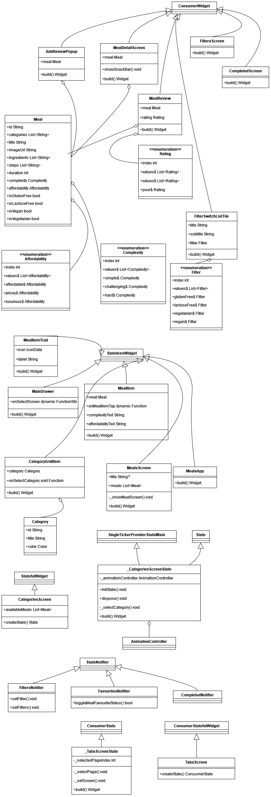
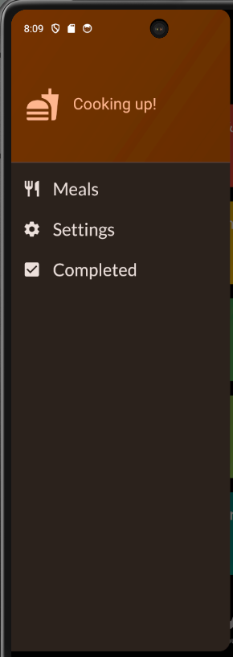
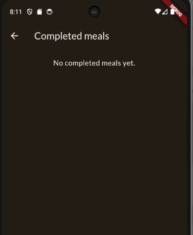
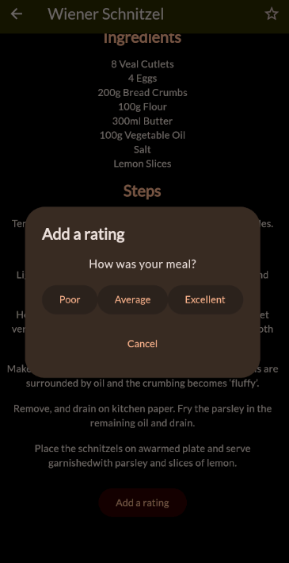
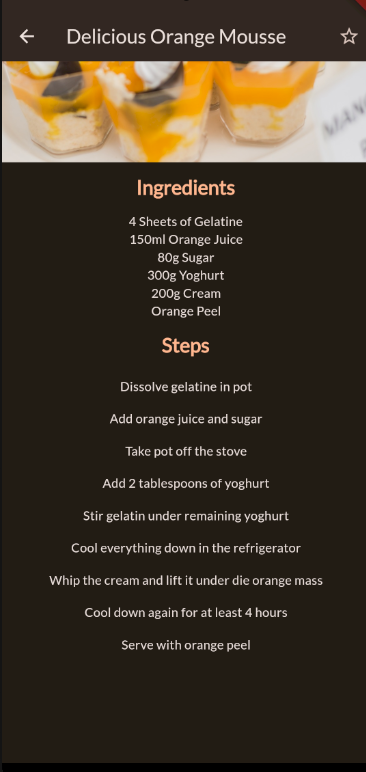
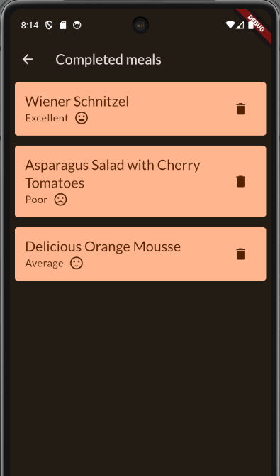

# meals
Simple meals app. This project is assignment 2 in [IDATA2503 - Mobile applications](https://www.ntnu.edu/studies/courses/IDATA2503) course at NTNU. Below is the documentation required for the assignment.  

## User stories
- As a user, I want to be able to look at meals divided into categories, so that I can find a meal I want to make.
- As a user, I want to be able to add a meal to my favorites, so that I can find it easily later.
- As a user, I want to be able to remove a meal from my favorites, so that I can remove meals I don't like anymore.
- As a user, I want to be able to setup filters, so that I can find meals that fit my diet.
- As a user, I want to be able to add a rating to a meal, so that I can remember if I liked it or not.
- As a user, I want to be able to see my completed meals, so that I can remember what I have made before.

## App architecture
MealsApp is the main app widget class, which is in effect the root of the widget tree. The child widget of MealsApp is MaterialApp with home set to `TabsScreen`, which is a ConstumerStatefulWidget. It displays two tabs, one is `CategoriesScreen` and the other is `FavoritesScreen`. Both of these are StatelessWidgets. The `CategoriesScreen` displays a list of categories, which are clickable. When clicked user is taken to MealsScreen. Other tab is favourites where the user is taken to MealsScreen again but the meals shown are ones marked as favourites. This screen also has a drawer, with three different navigation options: Meals, Settings, Completed. Meals just closes the drawer, Settings opens new screen, FilterScreen where user can set filters for meals shown in categories. Completed shows a list of meals marked as completed and rated.

## Folder structure
main.dart is the entry point of the app, meals_app.dart is the main app widget class. All screens are located under screens folder.Widgets are located under widgets folder. Models are located under models folder. Providers are located under providers folder. Data is located under data folder.  

## Class diagram
  

## Extra feature
Extra navigation 'Completed' added to the drawer.  
  
If there are no completed meals, the user will be notified.  
  
Extra button 'Add a rating' added to the meal details page, if the meal is completed the button is not shown.
   
User can view completed meals in the 'Completed' screen along with the rating given. Trash icon button can be used to delete the meal from the list.    

## Collaboration with other student
